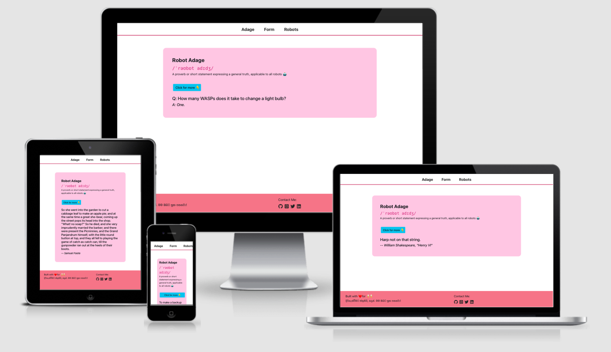
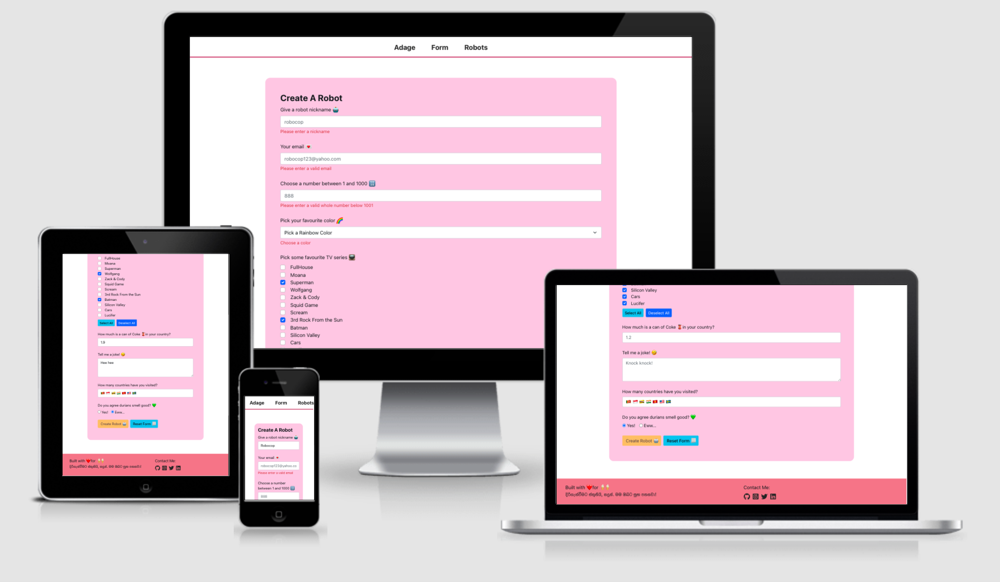
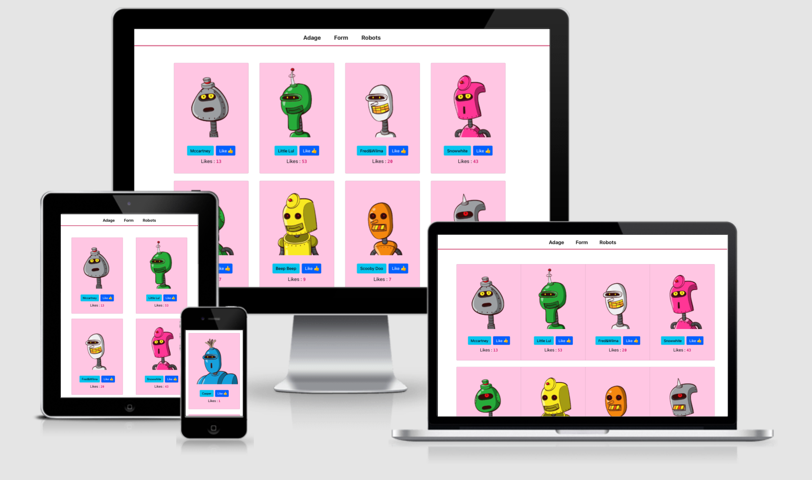
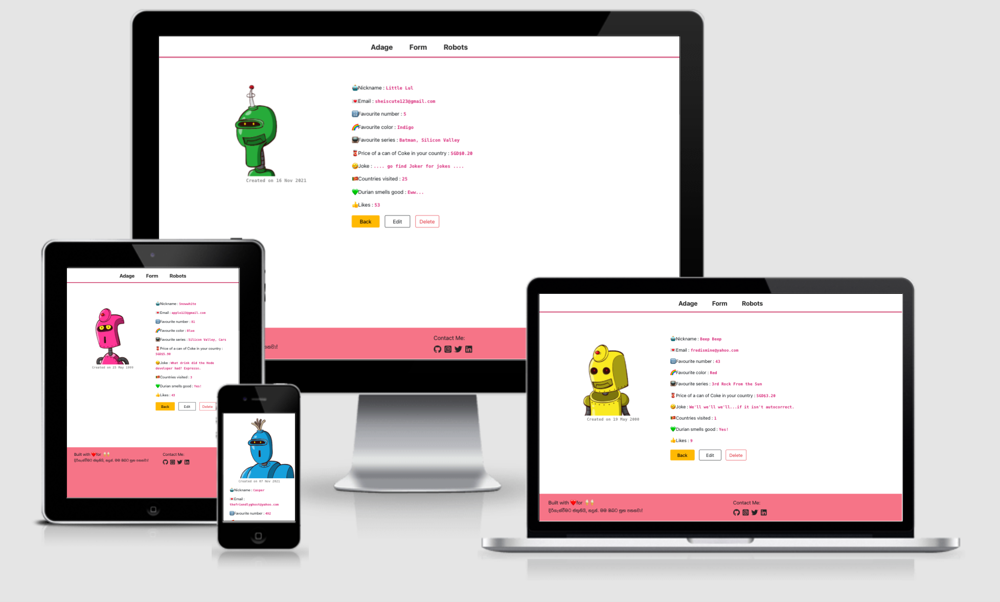
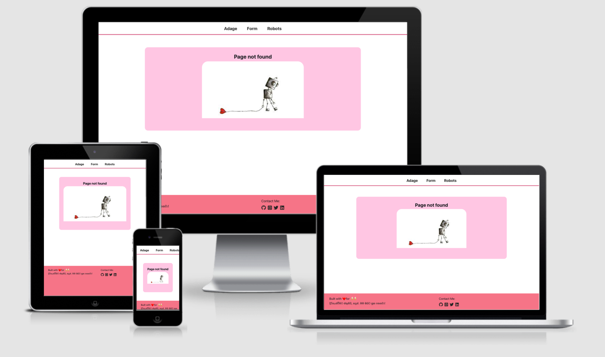

[Robots](https://robots-mern.herokuapp.com/) is deployed at Heroku. Click [here](https://robots-mern.herokuapp.com/) to see the live app.

## Story time 📖

Having started to learn and utilize React at work, I've always wanted to create a fullstack end-to-end MERN project so as to understand the whole flow better.

The project I have in mind is a music guessing game, but this is a start.

There were some errors especially with typescript incorporated and time was spent to recity the bugs 🐛🦟🕷️🐜. It was worth the effort as I learnt alot along the way and added some useful links in the resources sections.

As this is an ongoing project, I have included some work-in-progress notes at the bottom as a reminder of the various tasks.

I want to thank Nadun De Silva for his encouragement to get this ROBOT 🤖 going. He has this awesome Snake & Ladders game in the appstore. Please download it [here](https://play.google.com/store/apps/details?id=com.enadun.snakes.and.ladders).

## UI/UX

Going for a simple light theme. Chose a pinkish theme color to contrast the loud, vibrant colors of the robots.

As much as possible, I added media queries to make the pages responsive to medium and small devices.

## Images

1 Adage - proverbs and quotes

2 Form - create a robot form with validation messages

3 Robots - list of robots from MongoDB with 👍 like/upvote function

4 Details - details of a specific robot

5 Page not found - route doesn't match

Not listed

- 6 Edit - edit the particulars of a specific robot
- 7 Loading - spinner is displayed when waiting for response from backend / api

## Technologies

React Icons - Font Awesome

- https://react-icons.github.io/react-icons/

Bootstrap

- https://react-bootstrap.netlify.app/components/spinners/#spinners

Adage API

- https://isvbscriptdead.com/api/fortune/

Robot image API

- https://robohash.org/

JSON format checker

- https://www.jsonlint.com/

## Resources

Typescript errors
Indexable type vs Utility type

> type 'string' can't be used to index type X

- https://stackoverflow.com/questions/57667198/typescript-error-type-string-cant-be-used-to-index-type-x/57667278#57667278

Refresh page

- https://reactgo.com/react-refresh-page/

Memory leaks

> Warning: Can't perform a React state update on an unmounted component. THis is a no-op, but it indicates a memory leak in your application.

- https://www.debuggr.io/react-update-unmounted-component/
- https://dev.to/jexperton/how-to-fix-the-react-memory-leak-warning-d4i

Console warning for using <code>target="\_blank"</code> in Footer link

> Using target="\_blank" without rel="noreferrer" (which implies rel="noopener") is a security risk in older browsers: see https://mathiasbynens.github.io/rel-noopener/#recommendations

- https://stackoverflow.com/questions/57628890/why-people-use-rel-noopener-noreferrer-instead-of-just-rel-noreferrer

Proxy error

> Proxy error: Could not proxy request /robots/robocops/edit from localhost:3000 to http://localhost:8000.

- TO BE FILLED WHEN SOLVED
- Temporary fix: show ThankYouModal after user edit/create robot

Get various year/month/datetime

- https://www.w3schools.com/js/js_dates.asp

Checkboxes

- http://react.tips/checkboxes-in-react-16/
- https://www.positronx.io/react-checkbox-tutorial-handle-multiple-checkboxes-values/
- https://medium.com/@wlodarczyk_j/handling-multiple-checkboxes-in-react-js-337863fd284e

Radio buttons

- https://dirask.com/posts/Simple-way-to-use-multiple-radio-buttons-in-React-1xVY4p

Map through objects

- https://stackoverflow.com/questions/5072136/javascript-filter-for-objects/37616104

Display 2 decimal place

- https://developer.mozilla.org/en-US/docs/Web/JavaScript/Reference/Global_Objects/Number/toFixed

Footer stays at bottom

- https://www.freecodecamp.org/news/how-to-keep-your-footer-where-it-belongs-59c6aa05c59c/

MongoDB
How to do a 'PUT' request with data

- https://docs.mongodb.com/manual/reference/operator/update/set/

How to export JSON from local

- https://stackoverflow.com/questions/28733692/how-to-export-json-from-mongodb-using-robomongo

How to import JSON from local to MongoDB Atlas (Cloud)

- https://docs.atlas.mongodb.com/import/mongoimport/
- https://database.guide/import-documents-into-mongodb-from-an-array-of-json-documents/

Deploymnet to Heroku

- https://coursework.vschool.io/deploying-mern-app-to-heroku/

## Work In Progress & Future Enhancements

_(in no particular order)_

- [x] move local MongoDB to Cloud
- [x] add Spinner for when API is not loaded
- [x] build React package, serve on Express
- [x] refine the 'page not found' page
- [x] add notes to README.md
- [x] fix robot cards to be responsive
- [x] spinner displays after 'delete' robot for MongoDB Cloud
- [x] spinner displays after 'like' robot for MongoDB Cloud
- [x] fix this $1.00000000 display
- [x] add screenshots to README
- [x] deploy Robots to Heroku
- [] colour dropdown in EditForm to be populated
- [] when running on Express, do not show JSON format - has temporary fix now
- [] write unit tests
- [] add React Memo
- [] change from nickname to robot \_id to do PUT/DELETE requests
- [] add a simple robot game -> word guess / match robot / etc
- [] add slider to create/edit form for $coke 🥫
- [] add Redux / Redux saga for actions/reducers to change state
- [] break up create/edit form to more components
- [] write custom hook for edit form
- [] user login with their robot avatar
- [] multi users play game with their robot avatar
- [] robots have power that can increase with game plays
- [] add art from Art Institute Chicago API -> https://www.artic.edu/open-access/public-api
